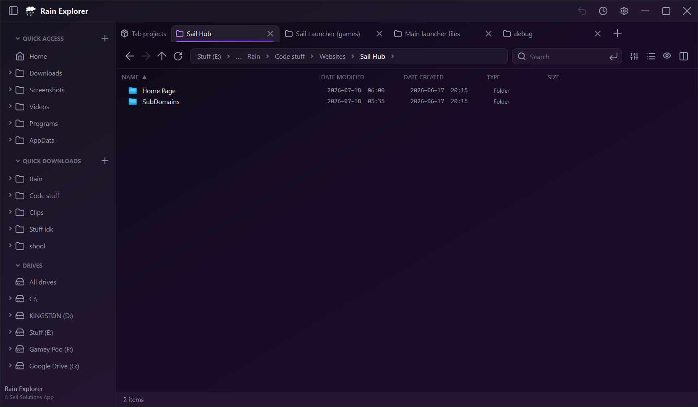

yo sorry i forgot to update source from v1.1.0...
# Rain Explorer

Rain Explorer is a modern Windows file manager built with WPF and .NET 10. It provides a fast, polished workspace for browsing folders, managing files, and organizing frequently used locations.



## Features

- Home, Drives, breadcrumb navigation, search, filtering, sorting, and multiple layouts.
- Tabs, split-pane browsing, tab drag-and-drop, and keyboard navigation shortcuts.
- Persistent tab and split-pane restoration across application and system restarts.
- Quick Access pins with custom icons, custom names, reordering, and multiple user-created sidebar lists.
- Drag folders onto sidebar sections to pin them, or move pins between sections.
- File operations including copy, cut, paste, rename, recycle/permanent delete, undo/redo, shortcuts, compression, and archive extraction.
- Native Windows context-menu integration and “Show more options”.
- Built-in preview pane, activity center, terminal shortcuts, hidden-file support, and configurable themes, density, fonts, and layouts.
- Automatic update checks with optional pre-release update support.

## Installation

Download the latest `RainExplorer-Setup-*.exe` installer from the repository’s [Releases](https://github.com/Aseoriy/Rain-Explorer/releases) page and run it. The installer is per-user and does not require administrator access by default.

## Building from source

### Requirements

- Windows 10 version 1809 or newer
- .NET 10 SDK
- Inno Setup 6 (only required to build the installer)

Build the application in Release mode:

```powershell
dotnet build Main\RainExplorer.csproj -c Release
```

Create a self-contained Windows payload:

```powershell
dotnet publish Main\RainExplorer.csproj `
  -c Release `
  -r win-x64 `
  --self-contained true `
  -o dist\app-sc
```

The installer script is located at [`Installer/RainExplorer.iss`](Installer/RainExplorer.iss). Update its local `SourceDir`, `IconFile`, and `OutputDir` paths for your checkout, then compile it with Inno Setup 6.

## Configuration

User settings are stored at:

```text
%APPDATA%\RainExplorer\settings.json
```

Settings are written atomically so an interrupted write does not replace the previous configuration. The application also keeps a crash log in the same directory when an unhandled error occurs.

## Project layout

```text
Main/         WPF application source
Installer/    Inno Setup installer script
dist/         Local build and installer output (ignored by Git)
Preview.png   Application preview image
```

## License

No license has been added to this repository yet. All rights are reserved by the project author unless a separate license is provided.
